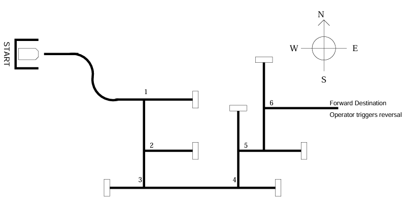

# Robot Guidance Challenge
## Table of Contents
- [Summary](#summary)
- [Features](#features)
  - [Guider](#guider)
  - [Subsystems](#subsystems)
    - [1. Navigation Manager](#1-navigation-manager)
    - [2. Guidance Routine](#2-guidance-routine)
    - [3. Sensor Scanner](#3-sensor-scanner)
    - [4. Motor Speed Control](#4-motor-speed-control)
    - [5. Rotation Counters](#5-rotation-counters)
    - [6. Bumper Detectors](#6-bumper-detectors)

## Summary
The objective of this project is to program an [eebot](https://www.ecb.torontomu.ca/~courses/coe538/Labs/eebot.pdf), a mobile robot built on an HCS12 microcontroller, to successfully traverse this maze:

<p align="center">
  
</p>

## Features
### Guider
The eebot implements a multi-guider system that is mounted at the underside of the bow area for line detection and tracking. It consists of 6 CdS (Cadmium Sulphide) photoresistors that change resistance based on light levels, enabling the eebot to detect and follow the black electrical tape line on the maze. 

The guider employs two types of sensors arranged in a strategic pattern:
- **Pattern detector (formed by absolute sensors A, B, C, and D)**
    - Four absolute brightness sensors detect line configurations and validate the eebot's position
    - Each sensor is driven by a constant current source, generating voltage proportional to light level
    - Sensor readings increase as surfaces become darker (higher resistance in darkness)
    - Used to detect line patterns including straight lines, turns, T-junctions, and line terminations
    - Typical readings: ~1.8V over light surfaces, ~3.0V over dark surfaces
- **Line tracker (used by sensors E and F)**
    - Voltage divider pair spaced 0.75 inches apart (matching tape width)
    - Provides differential feedback for precise line following
    - When centered on the line, both sensors equally straddle the tape edges
    - Output voltage indicates directional deviation from center
    - Faster response time (~25ms) compared to absolute sensors (~50ms) due to differential action
    - Largely immune to ambient light changes due to ratiometric measurement

The hardware is implemented as follows:
- High-intensity red LEDs to provide controlled illumination for each sensor
- LEDs mounted on PCB top side, illuminating through holes to protect alignment
- 74HC138 decoder enables individual LED selection to reduce crosstalk
- 74HC4051 analog multiplexer to route selected sensor to HCS12 A/D channel AN1
- PORTA pins (PA2-PA4) used to control sensor/LED selection via 3-bit address
- PA5 to enable/disable LED illumination for background measurement
- 8-bit A/D conversion with 48:1 prescaler (500 KHz ADC clock)
- Multiple conversions per sensor to support signal averaging for noise reduction

The guider software implements a structured API with the following components:

- **Sensor Reading Routine (`READ_SENSORS`):**
    - Scans all 5 sensors sequentially with proper timing
    - 20ms stabilization delay per sensor (accounts for CdS photoresistor darkening time constant)
    - Stores readings in dedicated RAM registers (SENSOR_LINE, SENSOR_BOW, SENSOR_PORT, SENSOR_MID, SENSOR_STBD)
    - Performs 4 conversions per channel for optional averaging

- **Sensor Selection (`SELECT_SENSOR`):**
    - Selects appropriate sensor via bit manipulation of PORTA register
    - Preserves motor direction bits during sensor switching
    - Aligns sensor selection bits with hardware multiplexer addressing

- **LED Control:**
    - `G_LEDS_ON` / `G_LEDS_OFF` routines enable measurement of ambient vs. illuminated conditions
    - Supports baseline subtraction for improved accuracy

- **Calibration Strategy:**
    - Variance-based thresholding using baseline values and measured variance
    - Separate calibration for each sensor accounts for individual characteristics
    - Software thresholds adapted based on surface reflectivity measurements

The guider becomes necessary to integrate with navigation, as it provides critical inputs to the eebot's state machine:
- Pattern detector validates line presence and detects geometric features
- Line tracker generates steering correction signals
- Combined sensor data enables robust navigation through complex maze patterns
- Sensor readings displayed on LCD in hexadecimal format for debugging

Ultimately, this multi-sensor approach provides redundancy and allows the eebot to distinguish between valid navigation scenarios (on-line, off-line, approaching turns) and make intelligent guidance decisions.

### Subsystems
This navigation system for the eebot integrates **six key subsystems** into a cohesive program architecture. Each subsystem performs a specialized function while coordinating with others through a centralized state machine.

#### 1. Navigation Manager
The navigation manager orchestrates overall robot behavior through a dispatcher-based state machine architecture. Implemented in the `DISPATCHER` routine, it manages eight distinct operational states:

**States:**
- `START`: Initial state waiting for bumper release to begin navigation
- `FWD`: Forward motion with active line following and obstacle detection
- `ALL_STOP`: Emergency stop state triggered by rear bumper collision
- `LEFT_TRN`: Partial left turn when PORT sensor detects line deviation
- `RIGHT_TRN`: Partial right turn when STBD sensor detects line deviation
- `REV_TRN`: Reverse and turn maneuver after forward bumper collision
- `LEFT_ALIGN`: Precision left alignment when LINE sensor detects leftward deviation
- `RIGHT_ALIGN`: Precision right alignment when LINE sensor detects rightward deviation

**Implementation:**
- Centralized state verification through sequential comparison (`VERIFY_START`, `VERIFY_FORWARD`, etc.)
- Each state has a dedicated handler routine that evaluates sensor conditions
- State transitions driven by sensor readings and bumper events
- Current state stored in `CRNT_STATE` RAM register for persistence
- State displayed on LCD for real-time debugging

#### 2. Guidance Routine
The guidance routine interprets sensor readings and generates appropriate motor commands for line following. Implemented primarily in the `FWD_ST` (forward state) handler:

**Line Detection Logic:**
- Evaluates BOW, MID, and LINE sensors to verify robot is centered on the line
- Compares each sensor reading against calibrated baseline ± variance threshold
- Variance-based thresholding accounts for sensor characteristics and ambient conditions

**Steering Decisions:**
- PORT sensor detection → triggers `PARTIAL_LEFT_TRN` for leftward correction
- STBD sensor detection → triggers `PARTIAL_RIGHT_TRN` for rightward correction
- LINE sensor deviation → triggers precision alignment (`LEFT_ALIGN` or `RIGHT_ALIGN` states)
- Aligned condition (BOW + MID + LINE within thresholds) → maintains forward motion

**Motor Commands:**
- Calls motor initialization routines (`INIT_LEFT`, `INIT_RIGHT`, `INIT_FWD`) based on guidance decision
- Inserts 300ms delays (LDY #6000) between directional changes to allow mechanical settling

#### 3. Sensor Scanner
The sensor scanner subsystem reads photodetector sensors and performs threshold comparisons to determine track visibility. Implemented through the guider API:

**Core Routine (`READ_SENSORS`):**
- Sequentially scans 5 sensors: LINE, BOW, PORT, MID, STBD
- Enables guider LEDs via `G_LEDS_ON` before scanning
- Performs A/D conversion on channel AN1 for each sensor
- Stores 8-bit results in dedicated RAM registers
- Disables LEDs via `G_LEDS_OFF` after scanning completes

**Thresholding Logic:**
- Baseline values stored for each sensor (`BASE_LINE` = $9D, `BASE_BOW` = $CA, etc.)
- Variance values define acceptable deviation (`LINE_VAR` = $18, `BOW_VAR` = $30, etc.)
- Track detection: Reading + Variance ≥ Baseline indicates dark line present
- Comparison performed using ADDA/SUBA and CMPA instructions
- Branch decisions (BPL/BMI) determine navigation actions

**Scan Rate:**
- Main loop continuously updates sensor readings
- 20ms stabilization delay per sensor accommodates CdS photoresistor response time
- Total scan cycle: ~100ms for all 5 sensors

#### 4. Motor Speed Control
Motor control subsystem manages differential drive steering through direction and speed manipulation:

**Hardware Interface:**
- PORTA bits 0-1: Motor direction control (0=FWD, 1=REV)
  - Bit 0: PORT motor direction
  - Bit 1: STBD motor direction
- PTT bits 4-5: Motor PWM enable (speed control)
  - Setting both bits enables full-speed operation

**Motor Control Routines:**
- `INIT_FWD` - Both motors forward at full speed (BCLR PORTA,%00000011; BSET PTT,%00110000)
- `INIT_REV` - Both motors reverse at full speed (BSET PORTA,%00000011; BSET PTT,%00110000)
- `INIT_LEFT` - Differential steering for left turn (BSET PORTA bit 0, BCLR PORTA bit 1)
- `INIT_RIGHT` - Differential steering for right turn (BSET PORTA bit 1, BCLR PORTA bit 0)
- `INIT_STOP` - Disable both motors (BCLR PTT,%00110000)

**Steering Mechanism:**
- Turns executed by setting opposite directions on PORT and STBD motors
- Creates pivot point near robot center for tight maneuvering
- Speed remains constant (binary on/off) - no proportional control implemented

#### 5. Rotation Counters
While traditional rotation counters (wheel encoders) are specified, this implementation uses a timer-based turning system:

**Timer Subsystem:**
- `TOF_COUNTER` - 8-bit counter incremented at 23Hz by Timer Overflow Interrupt
- Timer initialized via `ENABLE_TOF` routine (TSCR1, TSCR2 configuration)
- Prescaler set to 16 for appropriate overflow rate

**Turn Timing:**
- `T_TURN` register stores target time for turn completion
- Calculated as: Current `TOF_COUNTER` + Turn Duration
- Turn durations defined as constants (`T_LEFT` = 8, `T_RIGHT`= 8 ≈ 348ms per turn)
- Turn states check if `TOF_COUNTER` ≥ `T_TURN` to determine completion

**ISR Implementation:**
- `TOF_ISR` - Increments `TOF_COUNTER` and clears TOF flag
- Interrupt vector at $FFDE points to `TOF_ISR`
- Provides consistent timing regardless of main loop execution

**Limitation:**
- Time-based turns less precise than encoder-based rotation counting
- Accuracy affected by battery voltage, floor friction, and mechanical variations
- Adequate for maze navigation where line sensors provide feedback correction

#### 6. Bumper Detectors
Bumper detection provides collision sensing for obstacle avoidance and state management:

**Hardware Configuration:**
- PORTAD0 bit 2: Bow (front) bumper - active low
- PORTAD0 bit 3: Stern (rear) bumper - active low
- Bumpers are digital switches connected to A/D port configured as digital inputs

**Detection Implementation:**

*START State Monitoring:*
```
BRCLR PORTAD0, %00000100, RELEASE  ; Check bow bumper
```
- Waits for bow bumper release before transitioning to `FWD` state
- Prevents premature navigation start

*Forward State Monitoring:*
```
BRSET PORTAD0, $04, NO_FWD_BUMP    ; Check bow bumper
MOVB #REV_TRN, CRNT_STATE          ; Trigger reverse-turn
```
- Bow bumper collision → `REV_TRN` state (reverse + right turn sequence)
- Stern bumper collision → `ALL_STOP` state (emergency stop)

*Stop State Monitoring:*
```
BRSET PORTAD0, %00000100, NO_START_BUMP
MOVB #START, CRNT_STATE            ; Return to start
```
- Bow bumper press in `ALL_STOP` resets to `START` state
- Provides manual reset capability

**Response Actions:**
- Bow hit during `FWD`: 300ms reverse → 300ms right turn → resume navigation
- Stern hit: Immediate stop (dead end detection)
- Bumper polling occurs every main loop iteration (~100ms)

**Integration:**
All subsystems operate cooperatively through the state machine architecture. The navigation manager coordinates state transitions, the guidance routine interprets sensor data within each state, the sensor scanner continuously updates readings, motor control executes movement commands, timer-based rotation provides turn timing, and bumper detectors trigger safety responses. This modular design enables robust maze navigation with clear separation of concerns and maintainable code structure.